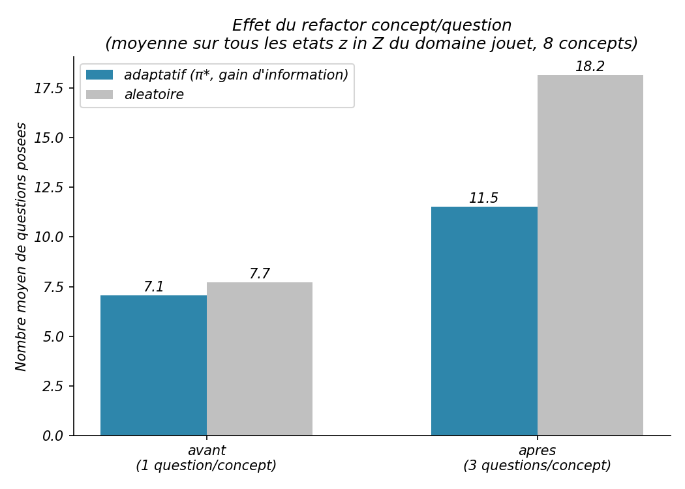
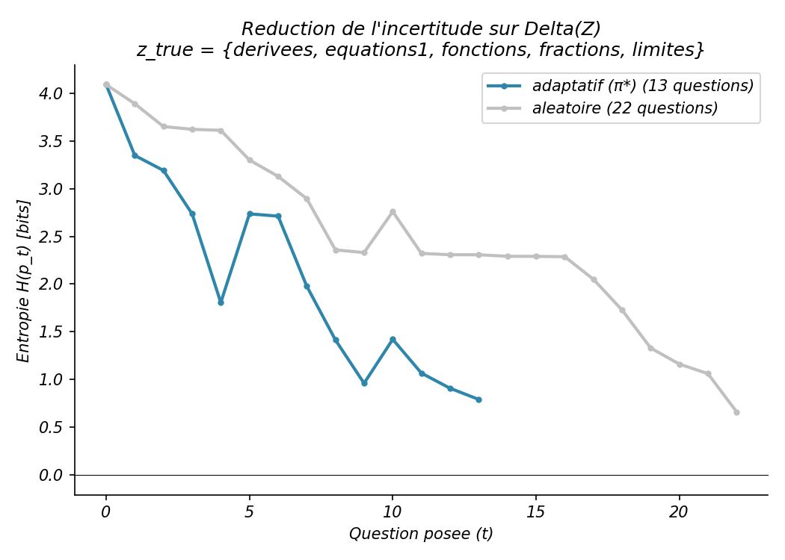
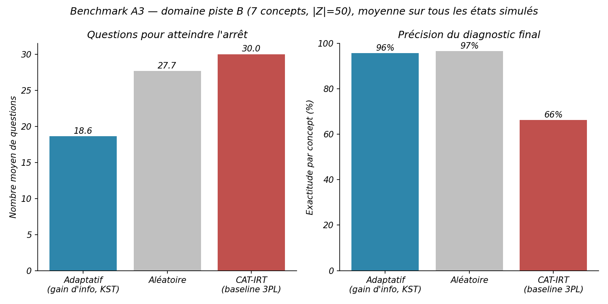

# Rapport d'avancement — Plateforme de quiz adaptatif (PFA UM6P)

> Document destiné à être partagé (ou donné à un autre assistant) pour discuter des prochaines étapes. Synthèse condensée de `CONTEXTE_PROJET.md`, qui reste le document de passation détaillé.

---

## Contexte et objectif

Projet de fin d'année (PFA) au UM6P Vanguard Center/CMSIS, encadré par Ahmed Ratnani (monographie *Foundations of Learning Systems Theory*, avec S. Ibnjaa, S. Kharou, A. Zahir). Objectif : une plateforme de quiz adaptatif fondée sur la **Knowledge Space Theory (KST)** — au lieu d'un score, on infère l'**état de connaissance** d'un étudiant (quel sous-ensemble de concepts il maîtrise) en sélectionnant à chaque tour la question qui maximise le gain d'information, avec mise à jour bayésienne (modèle BLIM) après chaque réponse.

**Contrainte structurante et récente** : le livrable final est un **rapport scientifique** (stage recherche, pas un produit) → l'app Streamlit suffit pour la démo/soutenance, pas besoin d'un frontend séparé. Une API FastAPI avait été envisagée (architecture cible initiale : FastAPI + Next.js) mais a été **explicitement écartée** pour l'instant — aucune valeur sans un vrai frontend Next.js prévu au calendrier.

Repo : [github.com/younesaouididden/adaptative-quizz](https://github.com/younesaouididden/adaptative-quizz) (privé).

---

## 1. Le moteur (`kst_engine.py`) — la fondation, stable depuis le début

Implémente les 4 couches de la théorie :
- **Combinatoire** : `build_knowledge_space` construit `Z` (l'espace des états de connaissance valides) à partir d'un graphe de prérequis entre concepts — fermeture transitive puis sous-ensembles clos vers le bas.
- **Probabilité (BLIM)** : `Domain`/`Concept`/`Question`, chaque question a son propre `slip` (erreur d'inattention) et `guess` (réponse au hasard), contrainte `slip+guess<1`. **Concept et Question sont volontairement séparés** (refactor fait tôt) : plusieurs questions par concept, ce qui donne un vrai choix à la sélection gloutonne.
- **Mise à jour bayésienne** : `bayes_update` sur `Δ(Z)`, en log-espace, avec lissage symétrique (prior et vraisemblance) pour éviter que `p(z)` s'écrase à 0 de façon irréversible.
- **Contrôle** : `select_next` (argmax du gain d'information exact), `should_stop` (trois critères : plafond de questions, confiance ≥ seuil, gain d'info résiduel négligeable).

Le cas d'or de la monographie (0,500 → 0,818) est vérifié par test. Le moteur n'a **aucune dépendance hors numpy** — un choix de conception délibérément maintenu (les chargeurs YAML, matplotlib, etc. vivent dans des modules séparés).

Le benchmark de Sprint 0 (avant/après le refactor concept/question) illustre pourquoi ce refactor comptait : sans plusieurs questions par concept, la sélection adaptative n'a rien à départager.

  

*Figure 1 — nombre moyen de questions posées, adaptatif vs aléatoire, avant (1 question/concept) et après (3 questions/concept) le refactor.*

  

*Figure 2 — trace de l'entropie H(pₜ) au fil des questions pour un étudiant simulé, adaptatif vs aléatoire : le mécanisme de réduction d'incertitude, pas seulement l'agrégat.*

---

## 2. Piste A — calibration scientifique sur données réelles (Junyi Academy)

Pipeline complet et fonctionnel :
1. `data/extract_junyi.py` construit un `domain.yaml` (concepts + prérequis) depuis les métadonnées d'exercices Junyi15, résout les conflits de direction de prérequis par test binomial bilatéral.
2. `data/extract_responses.py` construit `responses.parquet` depuis 26M lignes de logs bruts (lecture par chunks — la machine de dev a eu entre 0,6 et 8 Go de RAM libre selon les moments, donc streaming obligatoire).
3. `data/calibrate_em.py` calibre `slip`/`guess` par concept et le prior sur `Z` par espérance-maximisation, sous l'hypothèse assumée d'un `z` fixe par étudiant sur toute la période 2012-2015 (modéliser la progression temporelle est explicitement hors périmètre, cité comme perspective future).

### La saga du `guess` dégénéré (chapitre le plus long du projet, tranché)
- Domaine initial à 9 concepts (subdivision d'`arithmetic`/`algebra` par topic) → `guess` calibré anormalement élevé (0,40–0,76) sur 7 des 9 concepts.
- Deux tours d'investigation ont éliminé l'hypothèse de contamination par pratique répétée et l'hypothèse d'un problème d'identifiabilité (un run de contrôle par sous-échantillonnage hypergéométrique reproduit le même artefact) : **le jeu de données complet (25,9M réponses) reste bien identifié (écarts-types < 0,001 sur 5 redémarrages EM) et affiche quand même un `guess` élevé**.
- Conclusion retenue : c'est une limite d'**hétérogénéité des concepts** — des buckets larges violent l'hypothèse tout-ou-rien du BLIM (jamais formellement re-testée depuis, cf. "questions ouvertes" plus bas).
- **Décision finale sous contrainte de deadline** : domaine réduit à **5 concepts** (`arithmetic`, `algebra`, `geometry`, `analytic_geometry`, `probability_statistics`), `|Z|=18`. `guess` reste élevé (0,50–0,75) mais c'est documenté et accepté comme limite de la V1, pas un bug caché.

---

## 3. Piste B — banque de démo (reprise récemment)

Piste B (banque de questions écrites à la main, séparée de la piste A) était **en pause** depuis le début du projet. Reprise et étendue récemment :
- Domaine passé de 5 à **7 concepts**, en subdivisant précisément les deux buckets identifiés comme les plus larges/hétérogènes dans la saga du `guess` (`arithmetic` → `arithmetic_base` + `fractions_ratios`, `algebra` → `algebra_linear` + `algebra_advanced`). Argument clé : le problème d'hétérogénéité qui bloquait cette subdivision en piste A **ne s'applique pas ici**, puisque piste B n'utilise pas de calibration empirique : `guess = 1/nb_options = 0,25` est une **borne combinatoire conservatrice** (`guess ≤ 1/k` pour un QCM à `k` options, pas une valeur choisie), `slip = 0,10` un **point de référence sur un axe à balayer** (aucun argument de premier principe ne fixe `slip`).
- 35 questions écrites à la main (5 par concept, difficulté variée, distracteurs pensés pour incarner une erreur de raisonnement plausible plutôt qu'absurde).
- `|Z| = 50` pour ce domaine.
- Infrastructure : `domains/piste_b.yaml` (schéma config, jamais de contenu en dur dans le code), `domains/loader.py` (chargeur générique), `domains/validate.py` (validateur : cycles, `slip+guess<1`, ≥3 questions/concept, ids uniques), `domains/test_loader.py` (8 tests).

L'app Streamlit (`app.py`) a été basculée sur ce domaine piste B (elle chargeait auparavant le domaine calibré piste A). L'UI a été corrigée pour ne plus prétendre à une calibration empirique qu'elle n'a pas — point d'honnêteté scientifique important pour le rapport. **Piste A reste intacte et disponible séparément** (`data/domain.yaml`) pour tout usage nécessitant les vraies données calibrées.

App vérifiée en navigateur de bout en bout (intro → 13-16 questions → diagnostic par concept correct sur les 7 concepts). Déployée sur Streamlit Community Cloud — **à redéployer/rafraîchir** suite à ce changement (action utilisateur).

---

## 4. Benchmark A3 — adaptatif vs aléatoire vs CAT-IRT

Comparaison de trois politiques de sélection de questions sur la banque piste B (35 questions, 7 concepts), en rejouant **exhaustivement les 50 états** de `Z` avec des étudiants simulés. Le processus génératif (vérité terrain BLIM, mêmes `slip`/`guess`) est **identique pour les trois politiques** — seul l'algorithme de sélection diffère, ce qui évite l'objection "l'écart vient de la banque, pas de la méthode".

| Politique | Questions (moy.) | Exactitude par concept |
|---|---|---|
| **Adaptatif (KST, gain d'info)** | 18,6 | 95,7 % |
| **Aléatoire** | 27,7 | 96,6 % |
| **CAT-IRT (baseline 3PL)** | 30,0 (plafond atteint) | 66,3 % |

  

*Figure 3 — benchmark A3 sur le domaine piste B (7 concepts, |Z|=50), moyenne sur tous les états simulés. Table brute : `benchmark_a3_table.csv`.*

**Deux résultats à retenir :**
1. L'adaptatif réduit le nombre de questions de **~33 %** par rapport à l'aléatoire, pour une précision quasi identique — gain d'**efficacité**, pas de précision (cohérent avec la théorie : l'IG optimise la vitesse de convergence).
2. Le CAT-IRT (θ continu unidimensionnel, sélection par information de Fisher, θ estimé par EAP) **s'effondre à 66 %** et n'atteint jamais son critère d'arrêt en 30 questions. C'est volontaire et interprétable : un θ unique ne peut pas résoudre un état de maîtrise partiel sur 7 concepts indépendants, alors que la vérité simulée reste un vrai état KST multi-concept. **Ce n'est pas "KST bat IRT en général"**, c'est "un CAT-IRT mal spécifié échoue face à des données réellement multi-dimensionnelles" — nuance à garder dans la rédaction.

Limite assumée et documentée : les paramètres IRT (a, b, c) sont **dérivés** de la banque BLIM existante (discrimination fixée à 1,0, faute de données pour l'estimer), pas calibrés indépendamment. Donc ce benchmark mesure un **gain algorithmique** sur une banque donnée, pas une validation empirique des paramètres eux-mêmes — celle-ci reste du ressort exclusif de la piste A (données réelles Junyi).

118 tests passent au total dans le projet (100 historiques + 8 chargeur piste B + 10 baseline IRT).

---

## 5. Ce qui reste ouvert / non résolu

- **Accès collègue à l'app Streamlit déployée** — action à faire par l'utilisateur (Share → e-mail, ou collaborateur GitHub), pas encore fait.
- **Redéploiement de l'app Streamlit** suite au changement de domaine (piste A → piste B) — pas encore fait.
- **L'hypothèse d'hétérogénéité des concepts** (piste A, cause du `guess` dégénéré) n'a jamais été formellement testée (le "D1" du plan de diagnostic original) — juste contournée par la simplification à 5 concepts. Reste une piste si le temps le permet.
- **Rédaction du rapport scientifique lui-même** — les résultats numériques existent (calibration piste A, benchmark A3) mais rien n'est encore rédigé en dur dans un document de mémoire/rapport.
- Le benchmark A3 n'a été exécuté que sur piste B (`guess` borné, `slip` fixé à un seul point) — le refaire tourner sur le domaine piste A (5 concepts, calibré empiriquement sur Junyi) donnerait un second point de comparaison ; il faudra un plafond de questions relevé (150, pas 30 — cf. `note_calibration.md` §6), sinon on mesure le plafond et non la méthode. Pas encore fait.

---

## 6. Style de travail établi sur ce projet

Petits incréments testables, un test pytest par fonction sur fixtures synthétiques (jamais les fichiers réels multi-millions de lignes), fonctions mathématiques commentées avec le numéro de chapitre de la monographie correspondant, commit+push après chaque étape significative avec messages détaillés, documents de passation écrits à chaque décision importante.
