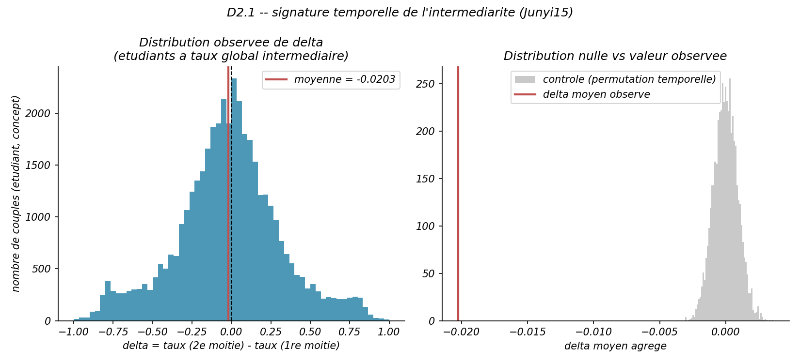

# Rapport — Hypothèse `z` fixe (D2)

> Périmètre : `PROMPT_D2_HYPOTHESE_Z.md`. Complète `CONTEXTE_PROJET.md` (§4, la saga du `guess` dégénéré) et `BILAN_CRITIQUE.md` (§3.2) avec le détail du test et son résultat. Code : `d2_1_signature_temporelle.py`. Tests : `test_d2_1_signature_temporelle.py` (17 tests, fixtures synthétiques). Résultats bruts : `results/d2_1_signature_temporelle/`. Commit : `6f1312e`.
>
> **Résultat en une phrase : l'hypothèse `z` fixe est écartée.** Chez les étudiants dont le taux de réussite est intermédiaire, le taux ne progresse pas dans le temps — il stagne, voire baisse légèrement — et ce constat ne survit à aucun degré au contrôle statistique.

---

## Pourquoi ce test

La calibration EM de la piste A (`data/domain.yaml`, 25,9 M réponses Junyi15) donne un `guess` de 0,50 à 0,75 selon le concept — implausible pour un vrai taux de réponse au hasard. Deux explications avaient déjà été testées et écartées :

- **D0** (`docs/diagnostic_guess.md`, `docs/revue_d0_tour2.md`) : contamination par la pratique répétée → le mécanisme est réel mais insuffisant, un contrôle par échantillon aléatoire de même taille reproduit le même effet. C'était de l'**identifiabilité**, pas de la contamination.
- **D1** (`RAPPORT_LOT4.md`) : hétérogénéité des concepts trop larges → subdiviser `arithmetic` ne fait **pas** baisser `guess` (`arithmetic_base` isolé = 0,759 > `arithmetic` combiné = 0,746). Le fit isolé retombe presque exactement sur l'ancien fit joint.

Restait **D2 : l'hypothèse `z` fixe elle-même.** Le BLIM suppose un état de connaissance constant pendant tout le quiz ; les logs Junyi couvrent 2012-10 à 2015-01. Un étudiant qui apprend pendant cette fenêtre a, sur l'ensemble de la période, un taux de réussite intermédiaire qu'aucun `z` binaire ne peut expliquer — l'EM doit alors rapprocher `guess` de `1-slip` pour absorber ces cas. Si c'est la cause, l'intermédiarité doit être **ordonnée dans le temps** (échec tôt, réussite tard), pas dispersée au hasard — une prédiction falsifiable, testable directement sur les timestamps déjà présents dans `responses.parquet`, sans lancer un seul EM.

---

## Protocole (D2.1)

Seuils et critères **fixés avant de regarder un seul résultat**, repris tels quels du document de passation :

| Paramètre | Valeur | Rôle |
|---|---|---|
| Seuil minimum d'observations par (étudiant, concept) | `n_total ≥ 20` | Exclut les couples trop épars pour qu'un découpage en deux moitiés ait un sens |
| Bande de taux de réussite « intermédiaire » | `[0,40 ; 0,80]` | Isole les étudiants qui tirent `guess` vers le haut dans l'EM |
| Découpage temporel | Point milieu `(min_ts + max_ts) / 2` de l'historique du couple | Par le **temps**, jamais par le nombre d'essais — condition nécessaire pour distinguer D2 (apprentissage dans le temps) de la contamination par pratique répétée déjà écartée en D0 |
| Contrôle | Loi hypergéométrique **exacte**, 5000 réplications | Équivalente à une permutation aléatoire de l'ordre temporel des labels correct/incorrect à l'intérieur de chaque couple — même construction que le tour 2 de D0 |
| Critère de confirmation | `delta moyen ≥ 0,05` **ET** `p < 0,01` | Hausse jugée substantielle et significative |

Deux passes chunkées sur `data/responses.parquet` (jamais le fichier entier en mémoire — RAM limitée sur cette machine) :

1. **Passe 1** : `(n_correct, n_total, min_ts, max_ts)` par couple `(student_id, concept_id)`.
2. **Passe 2**, une fois le point milieu connu par couple retenu : `(n_correct, n_total)` par `(couple, moitié)`.

Aucune réextraction du log brut n'était nécessaire — `responses.parquet` contient déjà `timestamp`, contrairement à D1 qui avait dû retraiter 25,9 M lignes du CSV source.

---

## Résultat

| Étape | Couples (étudiant, concept) |
|---|---|
| Total dans `responses.parquet` | 379 374 |
| Retenus (`n_total ≥ 20`, décomposable en 2 moitiés non vides) | 136 228 |
| Dans la bande intermédiaire `[0,40 ; 0,80]` (analyse) | **41 246** |

  

| Métrique | Valeur |
|---|---|
| Delta moyen (taux 2ᵉ moitié − taux 1ʳᵉ moitié) | **−0,0203** |
| Delta médian | −0,0160 |
| Fraction de couples en hausse | 47,0 % |
| Moyenne du contrôle (permutation temporelle) | ≈ 0,000000 |
| Écart-type du contrôle | 0,000913 |
| p-value unilatérale | **1** |

**Lecture.** La prédiction de D2 était une hausse systématique et substantielle chez les étudiants intermédiaires. Le résultat mesuré est l'inverse : une **légère baisse** en moyenne, et un partage quasi égal entre couples en hausse et en baisse (47 % vs 53 %) — la signature d'une dispersion aléatoire, pas d'une tendance temporelle. Le contrôle achève de trancher : sous permutation, le delta agrégé se concentre à moins de 0,001 autour de 0 (41 246 couples moyennés, bruit d'échantillonnage très faible) — la valeur observée (−0,0203), déjà dans la mauvaise direction, tombe hors de cette distribution nulle du mauvais côté. `p = 1` signifie que **100 % des 5000 réplications du contrôle** produisent une valeur au moins aussi grande que celle observée : aucune trace de signal temporel positif, à aucun degré.

**Verdict pré-enregistré appliqué** : `delta moyen ≥ 0,05` ET `p < 0,01` → **non satisfait sur les deux critères**. D2 est rejetée.

---

## Ce que ça ferme, ce que ça laisse ouvert

**Les deux seuls candidats identifiés pour expliquer le `guess` élevé sont maintenant écartés par des tests directs, pas par manque de temps :**

1. Hétérogénéité de granularité des concepts (D1) — écartée, `RAPPORT_LOT4.md`.
2. Apprentissage intra-fenêtre sous hypothèse `z` fixe (D2) — écartée, ce document.

**La cause du `guess` élevé reste inconnue.** Ce n'est plus une piste non explorée : c'est une énigme mesurée malgré une recherche active sur les deux hypothèses avancées, un résultat scientifiquement plus fort qu'une limite non testée — à présenter comme tel dans le mémoire, pas à maquiller en manque de temps.

**D2.2 et D2.3** (calibration par fenêtre temporelle, borne sur le gain potentiel d'un modèle à `z` évolutif) n'ont **pas** été lancées : elles étaient conditionnées à un résultat positif de D2.1 (`PROMPT_D2_HYPOTHESE_Z.md` §7 — « si D2.1 est négatif, s'arrêter là et documenter »). Les lancer maintenant n'aurait pas de sens sans une nouvelle hypothèse candidate à tester.

**Priorité inchangée** : le rapport de stage — le vrai livrable — est toujours à zéro page rédigée (`BILAN_CRITIQUE.md` §1). Ce test était un bonus scientifique explicitement identifié comme tel ; il referme proprement la saga du `guess`, mais ne remplace pas la rédaction.

---

## Traçabilité

17 nouveaux tests (`test_d2_1_signature_temporelle.py`, fixtures synthétiques — jamais `responses.parquet` réel dans les tests), 178 tests passent au total sur l'ensemble du dépôt. Graine déterministe `seed=0` (`np.random.default_rng`), 5000 réplications du contrôle hypergéométrique. Commit `6f1312e`, sur `master`, poussé sur `origin/master`. Détails d'exécution (date, commit, seuils) : `results/d2_1_signature_temporelle/run.log`.
