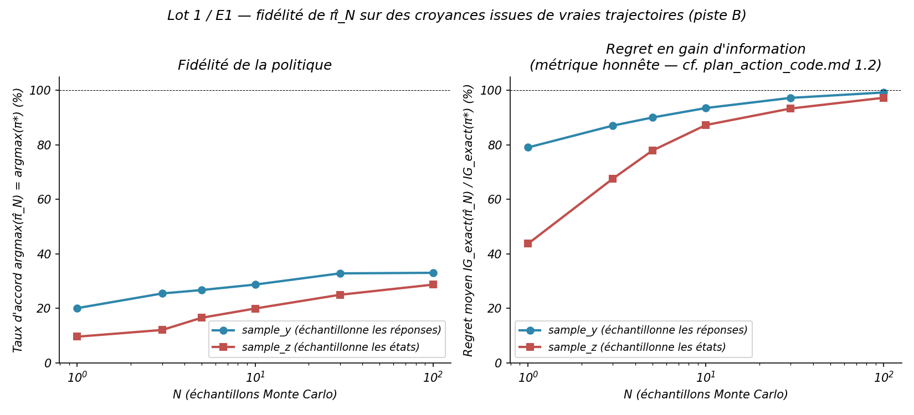
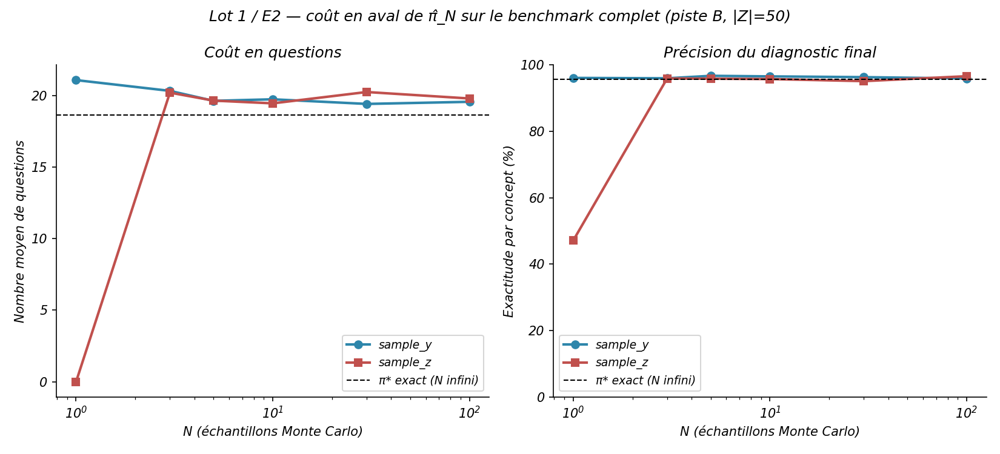
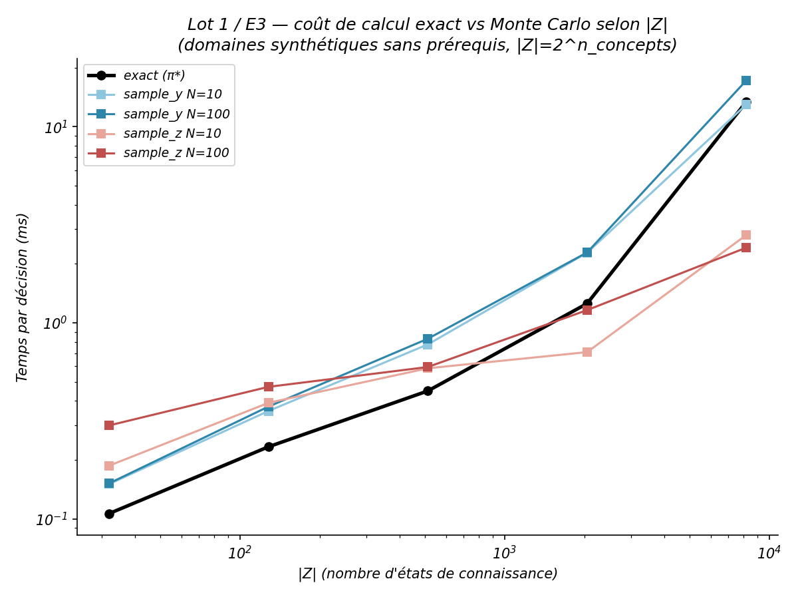

# Rapport Lot 1 — Validation de l'approximation Monte Carlo

> Périmètre : `plan_action_code.md`, Lot 1. Complète `CONTEXTE_PROJET.md` et `RAPPORT_AVANCEMENT.md` avec le détail des trois expériences (E1, E2, E3) et leurs figures. Code : `kst_engine.py` (`information_gain_mc`, `pi_hat`, `simulate_mc`), `lot1_e1_fidelite_politique.py`, `lot1_e2_cout_en_aval.py`, `lot1_e3_cout_calcul.py`. Résultats bruts : `results/lot1_e1/`, `results/lot1_e2/`, `results/lot1_e3/`.

---

## Pourquoi ce lot

La présentation d'août posait l'estimateur Monte Carlo comme un compromis biais-variance-temps sans le chiffrer. Mesurer l'erreur d'approximation exige la vérité exacte comme référence — c'est l'objet de ce lot, en trois temps : **E1** mesure la fidélité d'une décision isolée, **E2** le coût réel sur une trajectoire complète, **E3** le coût de calcul en fonction de la taille du domaine.

**Préalable du plan, résolu par construction plutôt que débattu** : l'estimateur original échantillonne les réponses `y`, ce qui n'attaque jamais le vrai goulot (`|Z|`). Deux modes ont été implémentés et comparés plutôt que de trancher a priori laquelle serait la bonne approche :

- **`sample_y`** — échantillonne les réponses. Un item étant binaire, il n'existe que deux postérieurs possibles quel que soit `N` ; l'implémentation a été optimisée en conséquence (un seul tirage binomial + deux postérieurs précalculés, au lieu d'une boucle de `N` mises à jour bayésiennes). Coût final `O(|Z|)`, **le même ordre que le calcul exact**, pour une valeur seulement approchée.
- **`sample_z`** — échantillonne les **états** `z ~ p(z)`, via la décomposition duale de l'information mutuelle `I(Z;Y|a) = H(Y|a) − E_z[H(Y|a,z)]`. Coût `O(N)`, **indépendant de `|Z|`** — la variante qui attaque le vrai goulot.

`pi_hat(p, domain, asked, n_samples, mode)` = π̂_N (notation du plan) implémente la politique gloutonne approximée, même structure que `pi_star` (π*, la politique exacte) mais évaluée par Monte Carlo.

---

## E1 — Fidélité de la politique

**Protocole.** 438 croyances issues de **vraies trajectoires** adaptatives (20 états de `domain.Z` rejoués avec π* sur le domaine piste B, 7 concepts, `|Z|=50`) — pas des priors uniformes artificiels. Pour chaque point, chaque mode et `N ∈ {1,3,5,10,30,100}` (10 réplications indépendantes) : taux d'accord `argmax(π̂_N) = argmax(π*)`, et **regret** `IG_exact(a_MC) / IG_exact(a*)`.

  

| N | accord `sample_y` | regret `sample_y` | accord `sample_z` | regret `sample_z` |
|---|---|---|---|---|
| 1 | 20,1 % | 79,1 % | 9,6 % | 43,7 % |
| 3 | 25,5 % | 87,1 % | 12,1 % | 67,6 % |
| 5 | 26,7 % | 90,0 % | 16,5 % | 77,9 % |
| 10 | 28,7 % | 93,5 % | 19,9 % | 87,3 % |
| 30 | 32,8 % | 97,3 % | 25,0 % | 93,4 % |
| 100 | 33,0 % | 99,2 % | 28,7 % | 97,3 % |

**Lecture.** Le taux d'accord est trompeur, exactement comme l'annonçait le plan : même à N=100, π̂_N ne retombe sur l'argmax exact que ~30 % du temps, mais la question choisie reste à 97-99 % du gain d'information optimal — choisir la deuxième meilleure question quasi équivalente ne coûte presque rien. **Le regret est la métrique honnête.** `sample_z` a besoin d'environ 3 à 5× plus d'échantillons que `sample_y` pour un regret équivalent (ex. `sample_y` à N=10 ≈ `sample_z` à N=30) — attendu, puisque `sample_y` profite gratuitement du calcul exact de `p_correct` (déjà payé), alors que `sample_z` ne touche jamais `Z` en entier.

Table brute : `results/lot1_e1/raw.csv` (52 560 lignes).

---

## E2 — Coût en aval

**Protocole.** Rejoue le benchmark complet (comme `benchmark_a3.py`) avec `simulate_mc` (π̂_N) au lieu de `simulate` (π*), sur les 50 états de `Z` × 5 réplications, pour chaque mode et N.

  

| N | questions `sample_y` | exactitude `sample_y` | questions `sample_z` | exactitude `sample_z` |
|---|---|---|---|---|
| — (π* exact) | **18,62** | **95,7 %** | — | — |
| 1 | 21,07 ± 5,46 | 96,1 % | **0,00 ± 0,00** | **47,1 %** |
| 3 | 20,32 ± 5,72 | 96,0 % | 20,19 ± 3,91 | 95,9 % |
| 5 | 19,62 ± 5,29 | 96,7 % | 19,64 ± 4,43 | 95,9 % |
| 10 | 19,73 ± 5,72 | 96,6 % | 19,44 ± 4,29 | 95,8 % |
| 30 | 19,40 ± 5,33 | 96,3 % | 20,24 ± 5,47 | 95,1 % |
| 100 | 19,55 ± 5,66 | 95,9 % | 19,78 ± 5,86 | 96,6 % |

**Lecture — résultat rassurant.** Dès N=3, les deux modes retombent quasiment sur l'exact (~19-20 questions vs 18,62 ; ~96 % d'exactitude vs 95,7 %). Le faible taux d'accord mesuré par E1 **ne se traduit pas** en coût élevé sur une trajectoire complète — les erreurs de sélection individuelles se corrigent au fil du quiz.

**Piège découvert ici, invisible dans E1** : à **N=1**, `sample_z` est **dégénéré**, pas juste bruité. Avec un seul échantillon, `H(Y|a)` et `E_z[H(Y|a,z)]` sont calculés sur exactement le même point — leur différence vaut **0,0 exactement**, pour toute question, à chaque appel (pas juste en espérance). Conséquence en cascade : `pi_hat` retombe sur le premier candidat balayé (argmax sur des ex æquo à 0), et le critère d'arrêt se déclenche **immédiatement** — le quiz ne pose jamais aucune question, et le diagnostic final (47 % d'exactitude) ne vaut pas mieux que le hasard.

E1 ne révèle pas cette pathologie parce qu'il mesure une décision isolée à mi-trajectoire (croyance déjà informative, où l'estimateur n'est pas dans son cas dégénéré) ; E2 la révèle parce qu'il rejoue la boucle complète depuis le prior uniforme. **C'est exactement pourquoi les deux expériences étaient nécessaires.** `N=1` est proscrit avec `sample_z` (documenté dans `kst_engine.py`, testé par régression) ; `N≥3` suffit à lever la dégénérescence.

Table brute : `results/lot1_e2/raw.csv` (3 000 lignes).

---

## E3 — Coût de calcul selon `|Z|`

**Protocole.** Domaines synthétiques **sans prérequis** (`|Z| = 2^n_concepts`, pour isoler la dépendance en `|Z|` de la topologie du graphe), `n_concepts ∈ {5,7,9,11,13}` → `|Z|` de 32 à 8192. Temps d'**une décision complète** (tous les candidats évalués, prior uniforme, aucune question déjà posée — le cas le plus coûteux), mesuré par `timeit.autorange`.

  

| \|Z\| | exact (π*) | `sample_y` N=10 | `sample_y` N=100 | `sample_z` N=10 | `sample_z` N=100 |
|---|---|---|---|---|---|
| 32 | 0,107 ms | 0,151 ms | 0,152 ms | 0,187 ms | 0,300 ms |
| 128 | 0,234 ms | 0,355 ms | 0,374 ms | 0,391 ms | 0,472 ms |
| 512 | 0,450 ms | 0,776 ms | 0,830 ms | 0,587 ms | 0,596 ms |
| 2 048 | 1,254 ms | 2,275 ms | 2,284 ms | 0,709 ms | 1,161 ms |
| 8 192 | 13,411 ms | 12,986 ms | 17,224 ms | 2,806 ms | 2,418 ms |

**Lecture.** `sample_y` **croît avec `|Z|` comme l'exact** (même ordre de grandeur à chaque taille, jusqu'à converger presque exactement à `|Z|=8192`) — confirmation empirique qu'il n'est jamais avantageux, exactement l'argument du préambule du Lot 1. `sample_z` reste **quasi constant** sur toute la plage (0,2 à 2,8 ms) — la variante qui attaque vraiment le goulot `|Z|`.

Table brute : `results/lot1_e3/raw.csv`.

---

## Recommandation d'ingénierie chiffrée (livrable du Lot 1)

Croisement des courbes mesurées (interpolation log-log entre points adjacents) :

| Configuration | Coût mesuré | Croise l'exact vers |
|---|---|---|
| `sample_z`, N=10 | ~0,94 ms (±0,95), indépendant de la taille de Z | Z ≈ 1 379 états |
| `sample_z`, N=100 | ~0,99 ms (±0,77), indépendant de la taille de Z | Z ≈ 1 486 états |
| `sample_y`, N=10/100 | croît avec la taille de Z comme l'exact | jamais avantageux |

**En dessous de `|Z| ≈ 1 400`, calculer l'exact (`pi_star`). Au-delà, utiliser `sample_z` avec `N ≈ 10-30`** (E1 : regret déjà < 15 % à N=30, et E2 montre que le coût en aval à ce N est déjà quasi nul).

**Conséquence pratique pour ce PFA** : piste A (`|Z|=18`) et piste B (`|Z|=50`) sont très en dessous de ce seuil — calculer l'exact y reste toujours le bon choix. L'approximation Monte Carlo n'a d'intérêt que pour des domaines nettement plus riches que ceux actuellement utilisés dans ce projet. C'est un résultat négatif pour l'usage immédiat, mais c'est exactement ce que le Lot 1 devait établir : un chiffre plutôt qu'une intuition d'ingénierie non vérifiée.

*Seuil mesuré sur une machine et une version numpy données — à lire comme un ordre de grandeur, pas une constante universelle.*

---

## Ce qui reste

Seul le point **1.5** (figure `|Z|` en fonction du nombre de concepts, sur domaines réels + synthétiques) n'est pas fait — cosmétique, E3 couvre déjà l'essentiel du terrain qu'elle visait à justifier.

## Traçabilité

142 tests passent (dont 15 nouveaux pour ce lot : mode `sample_z`, `pi_hat`, `simulate_mc`, et la régression sur la dégénérescence à N=1). Commits : `d82a9f6` (1.1 + E1), `463004f` (E2 + E3), sur la branche `lot5-vocabulaire-theorie`. Graines et commit git enregistrés dans chaque `results/lot1_e*/run.log`.
