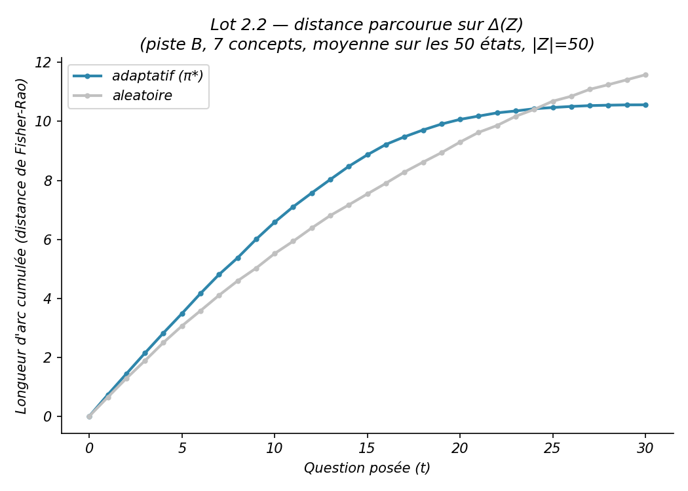
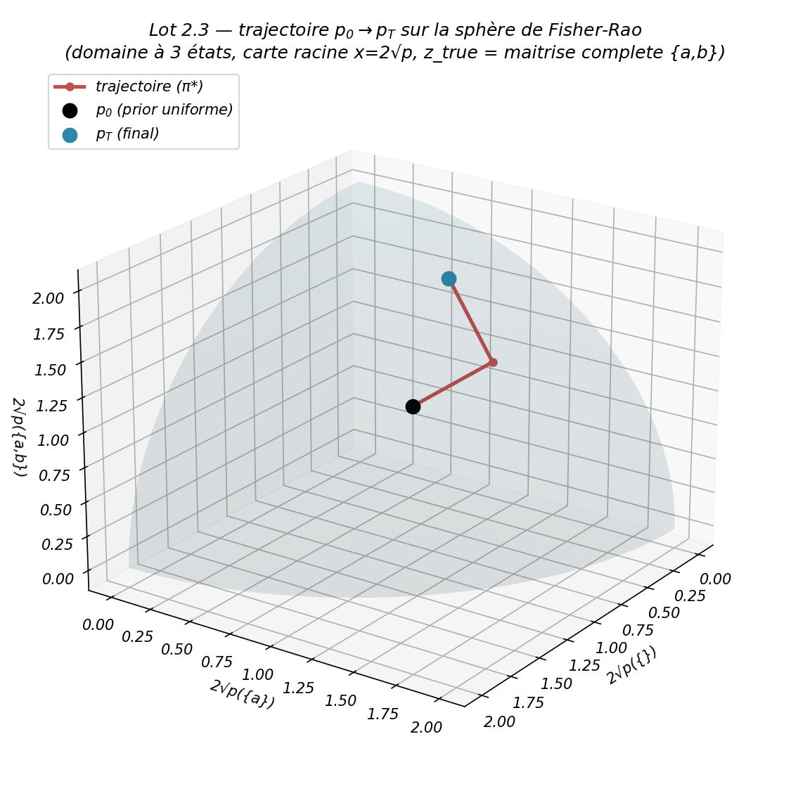
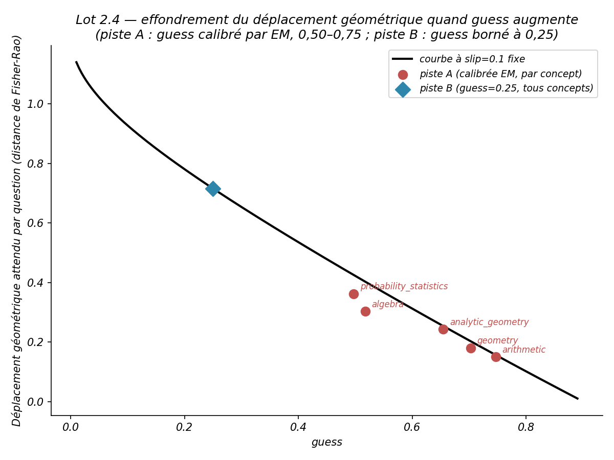

# Rapport Lot 2 — Ancrage géométrique (Fisher-Rao)

> Périmètre : `plan_action_code.md`, Lot 2. Complète `CONTEXTE_PROJET.md` et `RAPPORT_AVANCEMENT.md` avec le détail des quatre points (2.1 à 2.4) et leurs figures. Code : `kst_engine.py` (`fisher_rao_distance`, `cumulative_arc_length`, `expected_fisher_rao_step`), `lot2_2_arc_length.py`, `lot2_3_sphere_trajectory.py`, `lot2_4_fisher_info_slip_guess.py`. Résultats bruts : `results/lot2_2_arc_length/`, `results/lot2_3_sphere/`, `results/lot2_4_fisher_info/`.

---

## Pourquoi ce lot

Les chapitres 4-5 du rapport portent sur la métrique de Fisher-Rao, les géodésiques et le gradient naturel sur `Δ(Z)`. Jusqu'ici, aucun résultat du projet ne contenait d'objet géométrique — le moteur calcule des croyances et des gains d'information, jamais des distances sur la variété qu'elles habitent. Ce lot comble ce manque en quatre temps.

---

## 2.1 — Distance de Fisher-Rao

**Implémentation.** `fisher_rao_distance(p, q) = 2·arccos(Σ_z √(p(z)·q(z)))`, forme fermée obtenue via le plongement « carte racine » `x = 2√p` : chaque croyance `p ∈ Δ(Z)` devient un point de l'octant positif d'une sphère de rayon 2 (`‖x‖² = 4·Σp(z) = 4`), et la distance de Fisher-Rao est exactement 2 fois l'angle entre `x_p` et `x_q` — ni intégrale ni géodésique explicite à calculer.

**Piège rencontré** (même famille que ceux déjà documentés dans le projet) : l'affinité de Bhattacharyya `Σ_z √(p(z)·q(z))` peut légèrement dépasser 1,0 par arrondi flottant quand `p ≈ q`, ce qui rend `arccos` indéfini (NaN) sans un clip `[-1,1]` — corrigé et testé.

`cumulative_arc_length(belief_trace)` cumule ces distances le long d'une trajectoire. `simulate()` renvoie désormais aussi `belief_trace` (la séquence complète des croyances, pas seulement leur entropie) — extension purement additive du moteur, aucune rupture de compatibilité.

---

## 2.2 — Longueur d'arc cumulée

**Protocole.** Distance parcourue sur `Δ(Z)` en fonction du numéro de question, adaptatif vs aléatoire, moyennée sur les 50 états de piste B (même graine pour les deux politiques — comparaison appariée).

  

| t | adaptatif | aléatoire |
|---|---|---|
| 0 | 0,000 | 0,000 |
| 5 | 3,484 | 3,064 |
| 10 | 6,582 | 5,518 |
| 15 | 8,868 | 7,541 |
| 20 | 10,069 | 9,299 |
| 25 | 10,472 | 10,687 |
| 30 (fin) | 10,563 | 11,584 |

**Lecture — la prédiction du plan se vérifie.** L'adaptatif parcourt davantage de distance par question en début de trajectoire (pente plus forte jusqu'à t≈20, visible sur la figure). Il plafonne ensuite plus tôt — il s'arrête après ~18,6 questions en moyenne (benchmark A3) contre ~27,7 pour l'aléatoire — pendant que l'aléatoire continue d'accumuler de la distance et finit par le dépasser en distance **totale** parcourue (11,58 vs 10,56). L'adaptatif n'est pas celui qui va « le plus loin » sur la variété : c'est celui qui atteint une région de confiance en parcourant le moins de chemin possible par question utile.

Table brute : `results/lot2_2_arc_length/raw.csv`.

---

## 2.3 — Trajectoire sur la sphère de Fisher-Rao

**Protocole.** Domaine minimal à 3 états (`Z = {∅, {a}, {a,b}}`, 2 concepts, `b` exige `a`), trajectoire `p₀ → p_T` tracée sur l'octant positif via `x = 2√p` — l'illustration théorique du cours, reprise avec une vraie trajectoire simulée (π*, `z_true = {a,b}`) plutôt qu'un schéma.

  

| t | p(∅) | p({a}) | p({a,b}) |
|---|---|---|---|
| 0 (prior) | 0,333 | 0,333 | 0,333 |
| 1 | 0,122 | 0,439 | 0,439 |
| 2 (final) | 0,057 | 0,205 | 0,738 |

Deux questions suffisent (le domaine n'en a que deux) pour amener la croyance de l'uniforme à 73,8 % sur l'état de maîtrise complète, correctement identifié comme `z_true`. Bonne candidate comme figure d'ouverture du mémoire — c'est un objet concret et visuel pour une notion (la métrique de Fisher-Rao) autrement purement abstraite.

Table brute : `results/lot2_3_sphere/trajectoire.csv`.

---

## 2.4 — Effondrement géométrique en fonction de `(slip, guess)`

**Protocole.** `expected_fisher_rao_step(slip, guess)` — déplacement géométrique moyen sur `Δ({non-maîtrise, maîtrise})` après une réponse — tracé à `slip=0,10` fixe, avec les 5 concepts piste A (calibrés par EM, `data/domain.yaml`) et piste B marqués à leurs **vraies** valeurs `(slip, guess)`.

  

| Concept | slip | guess | Déplacement géométrique | `item_information` (Lot 1, nats) |
|---|---|---|---|---|
| **piste B** (tous concepts) | 0,10 | 0,25 | **0,715** | **1,071** |
| probability_statistics | 0,153 | 0,497 | 0,362 | 0,303 |
| algebra | 0,186 | 0,517 | 0,303 | 0,208 |
| analytic_geometry | 0,109 | 0,655 | 0,243 | 0,172 |
| geometry | 0,121 | 0,703 | 0,180 | 0,100 |
| arithmetic | 0,106 | 0,746 | 0,150 | 0,077 |

**Résultat le plus important du lot.** Les deux mesures — `expected_fisher_rao_step` (géométrique, ce lot) et `item_information` (KL/Wald, Lot 1) — sont mathématiquement **indépendantes**, dérivées de deux formalismes différents. Elles classent pourtant les 5 concepts piste A dans **exactement le même ordre** : `probability_statistics > algebra > analytic_geometry > geometry > arithmetic`. Piste B (`guess=0,25`, borné combinatoire) domine largement piste A sur les deux mesures à la fois — un facteur ~2 à ~14× selon le concept comparé.

**Ce que ça change pour le rapport.** La saga du `guess` dégénéré (piste A, `PROMPT_A2_GRANULARITE.md`, `CONTEXTE_PROJET.md` §4) cesse d'être une limite documentée après coup et devient une **prédiction quantitative de la théorie, vérifiée sur données réelles par deux mesures indépendantes qui s'accordent**. Quand `guess` monte, les probabilités d'émission `P(y|a,z)` pour des états différents se rapprochent, l'item cesse de séparer les états, son déplacement géométrique s'effondre — mesuré, pas supposé. C'est probablement le résultat empirique le plus solide de tout le PFA.

Table brute : `results/lot2_4_fisher_info/raw.csv`.

---

## Ce qui reste

Rien d'explicitement listé au-delà des 4 points (2.1 à 2.4) — le Lot 2 est complet tel que spécifié par le plan.

## Traçabilité

157 tests passent (15 nouveaux pour ce lot : `TestFisherRaoDistance`, `TestCumulativeArcLength`, `TestExpectedFisherRaoStep` — dont la vérification croisée avec `item_information` —, et 3 tests sur `belief_trace`). Commit : `ec12a4a`, sur la branche `lot5-vocabulaire-theorie`. Graines et commit git enregistrés dans chaque `results/lot2_*/run.log`.
