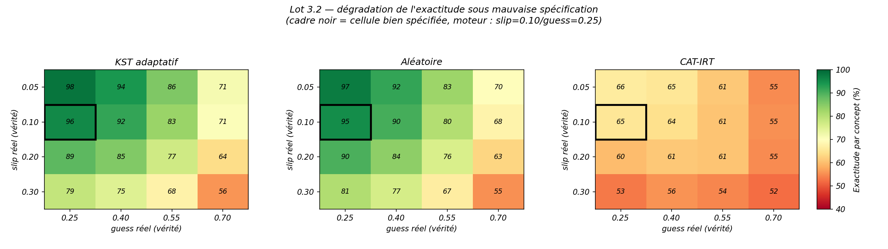
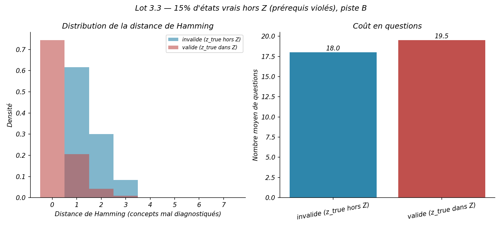
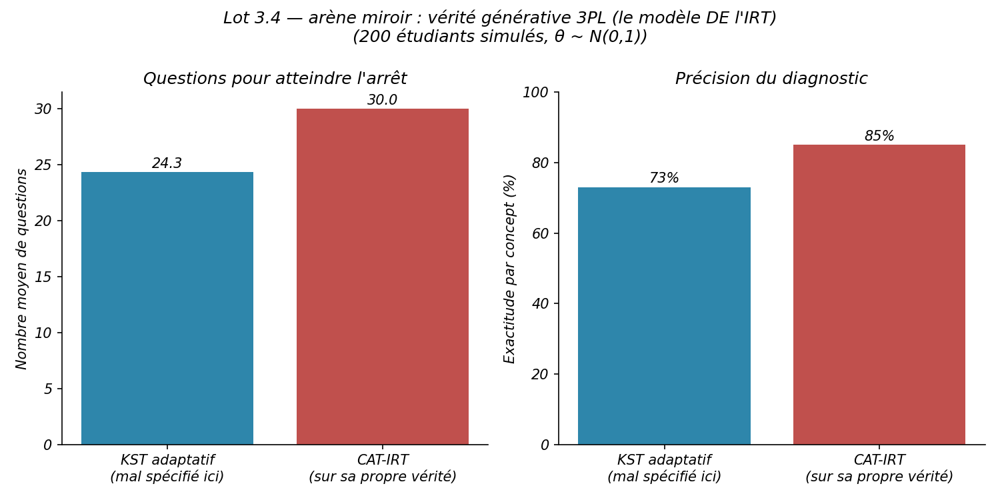
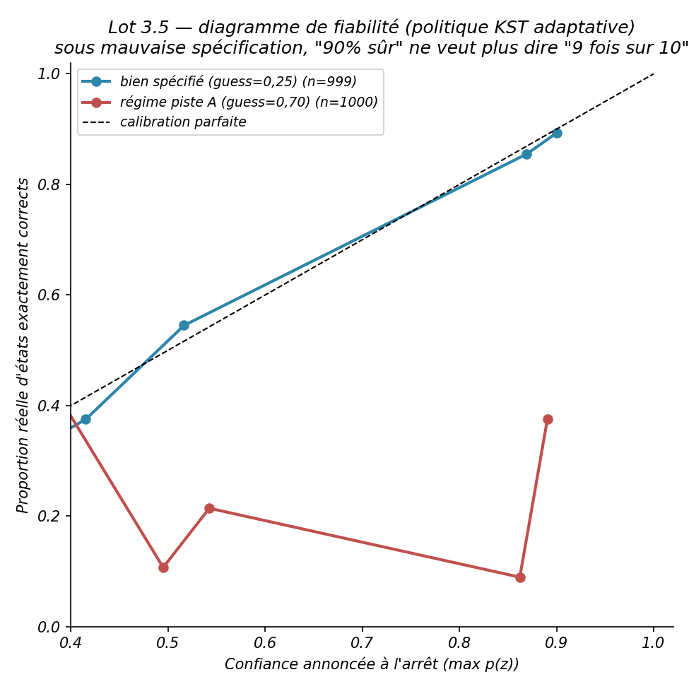
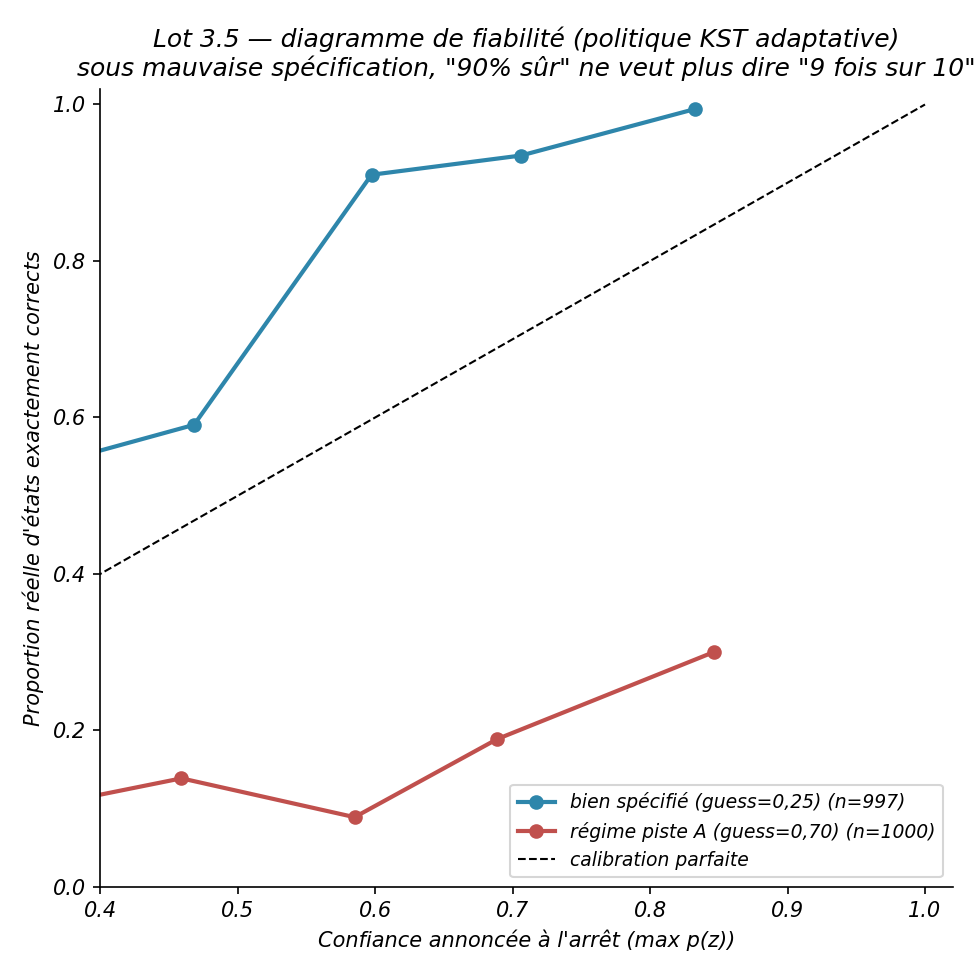

# Rapport Lot 3 — Robustesse à la mauvaise spécification

> Périmètre : `plan_action_code.md`, Lot 3. Complète `CONTEXTE_PROJET.md` et `RAPPORT_AVANCEMENT.md` avec le détail des six points (3.1 à 3.6) et leurs figures. Code : `kst_engine.py`/`irt_baseline.py` (décrochage vérité/moteur), `lot3_2_grille_mauvaise_specification.py`, `lot3_3_prereq_faux.py`, `lot3_4_arene_miroir.py`, `lot3_6_correction.py`. Résultats bruts : `results/lot3_2_grille/`, `results/lot3_3_prereq_faux/`, `results/lot3_4_arene_miroir/`, `results/lot3_6_correction/`.

---

## Pourquoi ce lot

Jusqu'ici, un seul jeu de paramètres génère les réponses simulées **et** est supposé par le moteur pour interpréter ces réponses — la vérité et la croyance du modèle coïncident toujours par construction. C'est l'objection la plus facile à formuler pour un jury : *« votre benchmark ne prouve rien, vous avez triché en donnant au modèle la bonne réponse d'avance. »* Ce lot répond en cassant systématiquement cette coïncidence, sur six angles différents.

---

## 3.1 — Découplage vérité/moteur

**Implémentation.** `simulate()` (`kst_engine.py`) et `simulate_irt()` (`irt_baseline.py`) gagnent chacun deux paramètres optionnels : `verite_slip` et `verite_guess`. S'ils sont fournis, la réponse de l'étudiant simulé est générée avec **ces** valeurs, alors que la mise à jour bayésienne (ou l'estimation 3PL) continue d'utiliser `domain.L` — ce que le moteur croit, figé à la construction du `Domain`. `None` (défaut) reproduit exactement le comportement d'avant ce lot. C'est le seul changement de signature demandé par le plan — pas une réécriture du simulateur. 4 tests, dont un vérifiant explicitement que la mise à jour bayésienne ignore la vérité fournie et ne dépend que de `domain.L`.

---

## 3.2 — Grille de bruit

**Protocole.** Moteur figé à piste B (`slip=0,10`/`guess=0,25`), vérité balayée sur `slip ∈ {0,05·0,10·0,20·0,30} × guess ∈ {0,25·0,40·0,55·0,70}` (16 cellules), 3 politiques (KST adaptatif, aléatoire, CAT-IRT), 50 états × 20 répétitions = 48 000 lignes.

  

**Exactitude par concept, KST adaptatif :**

| slip \\ guess | 0,25 | 0,40 | 0,55 | 0,70 |
|---|---|---|---|---|
| 0,05 | 98,1 % | 94,0 % | 85,6 % | 71,5 % |
| **0,10** | **95,8 %** | 91,8 % | 83,0 % | 70,7 % |
| 0,20 | 88,6 % | 85,5 % | 77,2 % | 63,9 % |
| 0,30 | 78,6 % | 75,1 % | 67,6 % | 55,9 % |

La cellule bien spécifiée (95,8 %) est cohérente avec le 95,7 % déjà mesuré par le benchmark A3 — vérification croisée. Dégradation nette dans les deux directions (slip et guess réels au-delà de ce que le moteur croit), avec le même schéma pour l'aléatoire ; le CAT-IRT, déjà mal spécifié par construction (θ continu vs état discret), plafonne à 66 % même bien spécifié et se dégrade plus doucement en absolu.

---

## 3.3 — Graphe de prérequis faux

**Protocole.** 400 étudiants simulés, 15 % (60) avec un état vrai **hors** `Z` — viole la structure de prérequis de piste B (ex. `algebra_advanced` maîtrisé sans `algebra_linear`, 78 états invalides possibles sur 128 sous-ensembles). Le moteur ne peut structurellement pas représenter un tel état : `correct_diagnosis` est faux par construction pour ce groupe, ce n'est pas la bonne métrique. La distance de Hamming (nombre de concepts où le diagnostic diffère de la vérité) reste bien définie dans tous les cas.

  

| Groupe | n | Questions (moy.) | Hamming (moy.) |
|---|---|---|---|
| États valides | 340 | 19,52 | 0,315 |
| États hors Z | 60 | 18,02 | **1,467** |

Dégradation nette (~4,7×) mais **gracieuse**, pas un effondrement : même sur un état structurellement irreprésentable, le moteur reste correct sur 5,5 des 7 concepts en moyenne.

---

## 3.4 — Arène miroir

**Protocole.** Vérité générée par un 3PL continu (le modèle *de* l'IRT) au lieu du BLIM discret, 200 étudiants (`θ ~ N(0,1)`). État de maîtrise « vrai » dérivé de θ par la même convention que `simulate_irt` (concept maîtrisé ssi `θ ≥` b moyen de ses items), pour comparer les deux politiques sur un terrain commun.

  

| Politique | Questions (moy.) | Exactitude par concept |
|---|---|---|
| KST adaptatif (mal spécifié ici) | 24,3 ± 5,8 | 73,1 % |
| **CAT-IRT (sur sa propre vérité)** | 30,0 (plafond) | **85,0 %** |

**Résultat voulu et confirmé : l'IRT gagne sur sa propre vérité générative** — l'exact miroir du benchmark A3 (vérité BLIM : KST 95,7 % vs IRT 66,3 %). Le message n'est pas « KST bat IRT » ni l'inverse : **chaque modèle domine sur sa propre vérité générative**, et la vraie question — laquelle des deux décrit effectivement les données Junyi — renvoie à la piste A, désamorçant proprement l'objection de l'arène truquée.

---

## 3.5 — Calibration de la confiance

**Protocole.** Diagramme de fiabilité (confiance annoncée à l'arrêt vs proportion réelle d'états exactement corrects), politique KST adaptative, sur les mêmes runs que 3.2, pour la cellule bien spécifiée et la cellule « régime piste A » (`guess=0,70`, le niveau effectivement mesuré par calibration EM).

  

| Cellule | Confiance moy. | Exactitude réelle moy. | ECE |
|---|---|---|---|
| Bien spécifiée (guess=0,25) | 0,770 | 0,764 | **0,018** |
| Régime piste A (guess=0,70) | 0,590 | 0,132 | **0,467** |

Bien spécifié : la courbe suit la diagonale. Régime piste A : la confiance annoncée atteint ~90 % en fin de courbe pour une exactitude réelle de ~10-38 % selon le palier — **« 90 % sûr » ne veut plus dire « 9 fois sur 10 »**, mesuré et chiffré (ECE=0,467), pas seulement affirmé.

---

## 3.6 — Correction

**Protocole.** Même grille rejouée avec un moteur volontairement prudent (`slip=0,20`/`guess=0,40` supposés, au lieu des vraies valeurs piste B `0,10`/`0,25`).

  

| Cellule | ECE avant (3.2) | ECE après (3.6) | Questions avant | Questions après |
|---|---|---|---|---|
| Bien spécifiée pour le moteur original | 0,018 | **0,195** (dégradé) | 19,3 | 27,3 |
| Régime piste A | 0,467 | **0,271** (amélioré, ~42 %) | 23,5 | 27,7 |

**Résultat plus nuancé que ne le suggérait le plan — ce n'est pas une simple restauration.** La prudence améliore réellement le pire cas (régime piste A) mais **dégrade** la cellule qui était déjà bien spécifiée (le moteur devient sous-confiant sans nécessité), et coûte plus de questions dans les deux cas. **La prudence n'est pas un correctif gratuit : c'est un compromis robustesse/précision explicite**, qui échange de la précision dans le cas normal contre de la robustesse dans le pire cas. Résultat honnête plutôt que forcé pour correspondre à l'attente du plan — cohérent avec l'esprit de `note_calibration.md`.

---

## Synthèse

| Point | Résultat en une phrase |
|---|---|
| 3.1 | Décrochage vérité/moteur implémenté, changement de signature minimal |
| 3.2 | Dégradation nette et mesurée sur toute une grille, cohérente avec le benchmark A3 |
| 3.3 | Dégradation gracieuse (pas d'effondrement) sur des états structurellement irreprésentables |
| 3.4 | Chaque modèle domine sur sa propre vérité — miroir exact du benchmark A3 |
| 3.5 | La mauvaise spécification casse vraiment la calibration (ECE×26) |
| 3.6 | Un moteur prudent est un compromis, pas un correctif gratuit |

## Traçabilité

161 tests passent (4 nouveaux pour 3.1). Commit : `16e2f6a`, sur la branche `lot5-vocabulaire-theorie`. Graines et commit git enregistrés dans chaque `results/lot3_*/run.log`.
