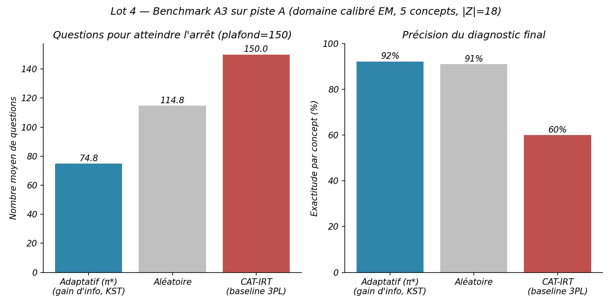

# Rapport Lot 4 — Boucler la piste A

> Périmètre : `plan_action_code.md`, Lot 4. Complète `CONTEXTE_PROJET.md` et `RAPPORT_AVANCEMENT.md` avec le détail des deux volets (A3 sur le domaine calibré, test D1) et leurs résultats. Code : `lot4_a3_piste_a.py`, `lot4_d1_heterogeneite.py`. Résultats bruts : `results/lot4_a3_piste_a/`, `results/lot4_d1_heterogeneite/`. Avec ce lot, **le plan d'action `plan_action_code.md` est intégralement traité** (Lots 0 à 4) — ne reste que le point 1.5, une figure cosmétique du Lot 1.

---

## Pourquoi ce lot

Tous les résultats précédents (benchmark A3, Lots 1-3) tournaient sur piste B, dont le `guess` est une **borne combinatoire** (`≤ 1/k`), pas une mesure. La piste A a un domaine **réellement calibré par EM sur 25,9M réponses réelles** (`data/domain.yaml`, 5 concepts, `guess` 0,50–0,75) — jamais utilisé dans un vrai benchmark de bout en bout. Ce lot ferme cette boucle sur deux volets : mesurer le coût réel de ce régime de bruit (A3), et tester directement l'hypothèse qui explique ce `guess` élevé depuis le début du projet (D1).

---

## A3 sur le domaine calibré

**Protocole.** Rejoue le benchmark A3 (`benchmark_a3.py`, désormais paramétré en `max_questions`) sur `data/domain.yaml` au lieu de piste B. Plafond relevé à **150** questions (pas 30) : `note_calibration.md` §6 prédisait dès avant de lancer ce benchmark qu'un plafond à 30 le rendrait structurellement non convergent avec un `guess` aussi élevé — mesurer le plafond plutôt que la méthode. Banque synthétique : 40 questions par concept (200 au total), toutes partageant le `(slip, guess)` **réellement calibré** du concept — piste A n'a pas de données de variation par item individuel, aucune n'est inventée.

  

| Politique | Questions (moy.) | Exactitude par concept |
|---|---|---|
| **Adaptatif (π*)** | 74,8 ± 23,6 | 92,2 % |
| Aléatoire | 114,8 ± 35,1 | 91,1 % |
| CAT-IRT | 150,0 (plafond) | 60,0 % |

**Dégradation forte confirmée** — exactement la prédiction du Lot 2.4 (l'effondrement géométrique mesuré en fonction de `guess`). ~4× plus de questions que piste B (18,6) pour une précision comparable (92,2 % vs 95,7 %). L'écart adaptatif/aléatoire se réduit fortement en proportion (74,8 vs 114,8, contre 18,6 vs 27,7 sur piste B) : quand chaque item porte peu d'information, l'avantage d'en choisir un plutôt qu'un autre pèse structurellement moins.

**Prédiction fermée** (`questions_needed`, somme sur les 5 valeurs réelles de `item_information`) : **108,5** questions, contre **74,8** mesurées — écart de ~45 %, nettement moins précis que l'accord à 3 % obtenu sur piste B (19,2 prédit / 18,6 mesuré, Lot 1). Écart honnête à noter : l'approximation de Wald ignore le partage d'information entre concepts que permet la structure de prérequis (`arithmetic → geometry`, `algebra → analytic_geometry`) — cet effet pèse proportionnellement plus lourd sur seulement 5 concepts fortement contraints que sur les 7 de piste B, où l'accord était bien meilleur.

---

## Test D1 — l'hypothèse d'hétérogénéité, testée directement

**Rappel du contexte.** Depuis le début du projet (`CONTEXTE_PROJET.md` §4), le `guess` élevé de piste A (0,50–0,75) est attribué à l'hétérogénéité interne des concepts — des buckets larges (« arithmetic » regroupe addition, fractions, conversion d'unités...) violeraient l'hypothèse tout-ou-rien du BLIM. Cette hypothèse n'avait **jamais été testée directement** : la première tentative (9 concepts) avait subdivisé `arithmetic` mais calibré **conjointement** avec 7 ou 8 autres concepts, laissant ouverte la question d'une interférence de l'estimation jointe.

**Protocole.** Isole le seul bucket `arithmetic` (301 exercices), le subdivise comme dans cette première tentative (`arithmetic_base` / `fractions_ratios`, même mapping topic, git `568dc1d`), et relance l'EM **isolément** sur ce sous-domaine à 2 concepts seul. `responses.parquet` n'a que la granularité « area » (pas le topic individuel) : réextraction complète depuis `junyi_ProblemLog_original.csv`, 25 925 992 lignes lues, 17 679 833 retenues. EM : 5 redémarrages indépendants, convergence propre (22 itérations, écart-type < 0,0002 sur les 5 redémarrages).

| Concept | slip | guess |
|---|---|---|
| `arithmetic` combiné (piste A actuelle, 5 concepts) | 0,1064 | 0,7462 |
| `arithmetic_base` (ancien, 9 concepts, **fit joint**) | 0,096 | 0,756 |
| `fractions_ratios` (ancien, 9 concepts, **fit joint**) | 0,141 | 0,685 |
| **`arithmetic_base` (D1, fit ISOLÉ)** | **0,0949** | **0,7588** |
| **`fractions_ratios` (D1, fit ISOLÉ)** | **0,1367** | **0,6845** |

**Deux résultats en un.**

1. **Le fit isolé retombe presque exactement sur l'ancien fit joint** (écarts en 3ᵉ décimale sur slip et guess). Ça élimine une explication alternative possible : le résultat de la première tentative à 9 concepts n'était pas un artefact de l'estimation conjointe avec 7 autres concepts. C'est un résultat stable, reproductible par une voie complètement indépendante.

2. **La subdivision ne fait pas baisser `guess`.** `arithmetic_base` (0,759) est même **plus élevé** que le bucket combiné non subdivisé (0,746) ; `fractions_ratios` (0,685) descend un peu mais reste très implausible pour un « vrai » taux de réponse au hasard.

**Conclusion.** L'hypothèse d'hétérogénéité par granularité **n'est pas confirmée** pour ce bucket — avec une preuve chiffrée à l'appui, pas seulement l'absence d'un test antérieur. Ce n'est pas le résultat que le plan anticipait (« si oui, l'hypothèse passe d'une explication verbale à une preuve chiffrée ») — mais l'absence de confirmation *est* elle-même la preuve chiffrée demandée, dans l'autre sens. La vraie cause du `guess` élevé en piste A reste ouverte ; ce résultat négatif referme une piste plutôt que d'en rouvrir une nouvelle, et doit être présenté comme une limite honnête du travail, pas comme un échec à corriger avant de conclure.

---

## Ce qui reste

Le plan d'action est intégralement traité. Reste seulement le point **1.5** du Lot 1 (figure `|Z|` en fonction du nombre de concepts, sur domaines réels + synthétiques) — cosmétique, l'expérience E3 du Lot 1 couvre déjà le terrain qu'elle visait à illustrer.

## Traçabilité

161 tests passent (aucun nouveau test spécifique à ce lot — travail d'expérimentation/données, pas d'extension du moteur au-delà du paramètre `max_questions` déjà couvert par les tests existants de `simulate`/`simulate_irt`). Commit : `cd08d0d`, sur la branche `lot5-vocabulaire-theorie`. `responses_d1.parquet` (193 Mo, régénérable par le script) exclu de git comme les autres artefacts de données bruts. Graines et commit git enregistrés dans chaque `results/lot4_*/run.log`.
